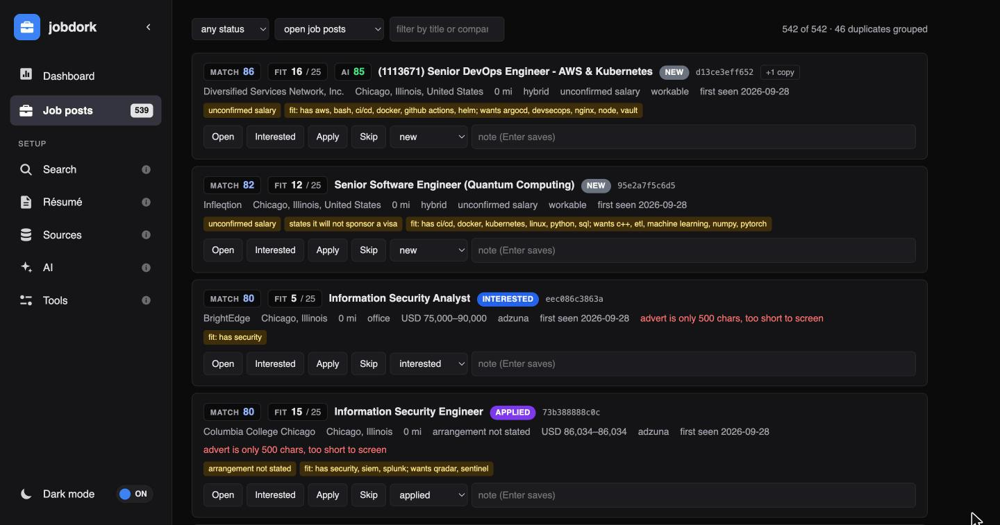
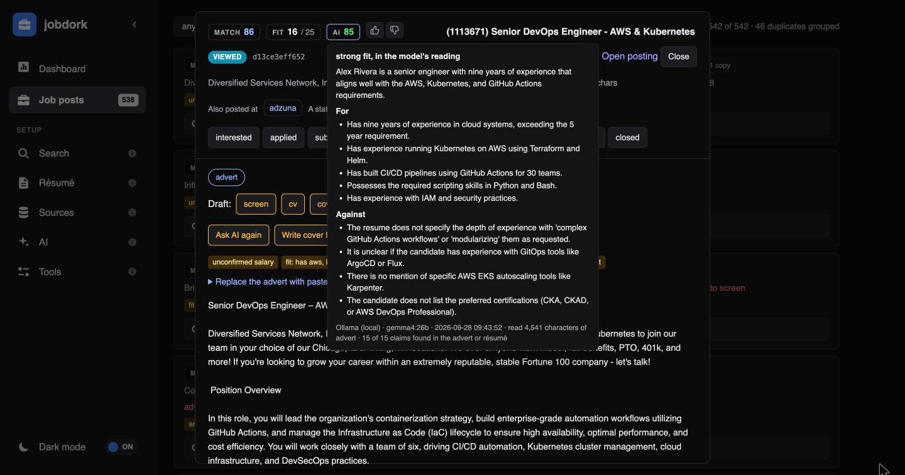
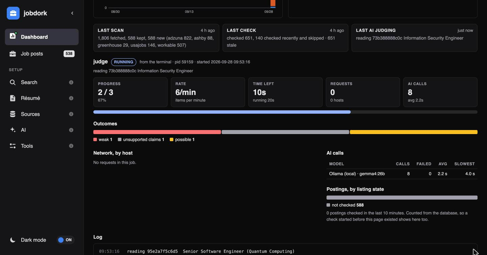

# jobDork

[](https://www.python.org/downloads/)
[](#license)

Find work two ways, and only hear about the roles that pass filters you wrote
down once.

**`jobdork dork`** builds Google searches you click yourself. It reaches
anything Google has indexed — including the hidden market that no applicant
tracking system exposes: role lists dropped in public Docs, recruiter posts
that go live before the listing, hiring managers to approach directly.

**`jobdork scan`** fetches structured postings straight from the ATS APIs,
screens them against your rules, and remembers what it already showed you.
Roles arrive as rows with a title, a location, an advert and sometimes a
salary — not as links.

Neither replaces the other, and the second one is why this stopped being a
query generator. A Google result is a thing you have to open to evaluate. A
row is a thing that can be filtered, scored, ranked against your resume, and
struck off when you have dealt with it.

```
$ jobdork scan
  usajobs: 156 roles, 15 requests
  adzuna: 822 roles, 25 requests
  workable: 1167 roles, 113 requests
fetched 1822, kept 660, stored 660 (660 new)
dropped: 1107x title matches nothing in titles.include; 27x 28 mi away,
outside 25 mi; 6x 147 mi away, outside 25 mi; 4x title excluded by
'support engineer'
```

That is a real run. The line worth reading is the last one: **1,107 of 1,822
roles were dropped on the title alone**, and the tool says so rather than
quietly handing you 660 and letting you assume that was everything there was.
Every drop has a reason and the reasons are counted.

Works anywhere. It ships a gazetteer of 70,026 places across 245 countries, so
a reader in Manila, Munich, Melbourne or Chicago configures their own countries
and everything else follows — including whether the radius is stated in miles
or kilometres.

Reading rather than running? [Under the hood](#under-the-hood) is the short
version and [docs/](docs/README.md) is the long one.

---

## Install

```bash
git clone <your-fork>
cd jobDork
python3 -m venv .venv && .venv/bin/pip install -e '.[pdf]'
cp config.example.yaml config.yaml     # then edit two lines
.venv/bin/python scripts/build_gazetteer.py
.venv/bin/python -m jobdork scan
```

The two lines are your job titles and where you live. Everything else has a
default. For the AI reader, add `'.[ai]'` to use Claude; a local Ollama, Gemini
and ChatGPT need nothing extra.

```yaml
titles:
  include: [software engineer, security analyst]
locations:
  anchor: "Chicago, IL"
```

**There is no `config.yaml` in the repository.** It is gitignored, along with
`.env`, `data/` and `out/`, so a fresh clone has none and nothing you put in
yours ever conflicts on a pull. Your search stays yours.

`build_gazetteer.py` downloads the place list the radius measures against. Run
it with no arguments and it builds for the countries in your config; `all`
builds every country. Without it the tool falls back to about 125 bundled
metros and still works in the places most postings name.

---

### Running in Docker

```bash
docker build -t jobdork .
docker run --rm -p 127.0.0.1:8765:8765 \
  -v "$PWD/config.yaml:/app/config.yaml" \
  -v "$PWD/.env:/app/.env:ro" \
  -v "$PWD/data:/app/data" -v "$PWD/out:/app/out" jobdork
```

Open the URL it prints. It runs as a non-root user, and the dashboard is
published to your own machine only.

**On a NAS or a home server,** follow [docs/DEPLOY.md](docs/DEPLOY.md):
installing Docker and Tailscale, running the AI on a separate computer, and
opening the dashboard from anywhere. In short, name the address you will open
it by, and publish the port to your network rather than to the NAS alone:

```bash
docker run -d --restart unless-stopped -p 8765:8765 \
  -e JOBDORK_ALLOW_HOSTS=192.168.1.50 \
  -v /volume1/docker/jobdork/config.yaml:/app/config.yaml \
  -v /volume1/docker/jobdork/data:/app/data jobdork
```

`JOBDORK_ALLOW_HOSTS` takes addresses separated by commas (`192.168.1.50`,
`nas.local`), on any port, or `address:port` for one port only. Nothing else
is let in, and a wildcard is refused. The container's log prints the full URL
with its access token; every request still needs that token, and a new one is
made each time the container starts. Keep it on your home network: do not
forward the port on your router.

Set the AI page's Ollama address to the computer that runs Ollama, by its
Tailscale name (`http://my-mac.tail1234.ts.net:11434`); inside the container,
`localhost` is the container itself. A NAS processor is too slow for a model:
on an 8 GB NAS one AI verdict took 8 minutes at 100% load. `llm.context`
(default 16,384 tokens) is how much text jobdork asks Ollama to make room for
on each call.

**Your resume and cover letters are temporary in Docker.** An uploaded resume
and every document written from it go to a folder inside the container that
is emptied when the dashboard starts and when it stops. Upload the resume
again after a restart, and use **Download** on a cover letter you want to
keep. Scan results and settings, in `data/` and `config.yaml`, are kept. On
your own machine nothing is temporary: the resume is kept in `data/` and
documents in `~/Documents/job-applications`.

Either way, the Resume page lists every cover letter, with **View** to read
one and **Delete** to remove its file and text at once.

## Where the jobs come from

**Nothing here needs a credential to start.** Workable's cross-employer search
takes a job title and answers for its whole market — no token, no account, no
list of employers to maintain. That is where most of the volume comes from.

Alongside it, five per-employer boards read one company each: Greenhouse,
Ashby, Lever, Breezy and SmartRecruiters. Coverage there is exactly the
companies you name, which is the trade for getting the full advert.

`jobdork discover` finds those, by reading the board token off the employer's
own careers page rather than guessing it from their name:

```
$ jobdork discover vectra.ai
Looking for vectra.ai...
  greenhouse         16 jobs  [verified]  .../boards/vectranetworks/jobs
                    board names itself 'Vectra'

Re-run with --add to write these into your config.
```

`vectranetworks` is why it reads rather than guesses. Tokens are not company
names — `mymoose` is Rapid7, `evergreenix` is Garrison — and a board that
answers is not proof you found the right company: on Ashby, `primer` is a
Florida micro-schools operator. Only a board found on their site **and**
returning jobs can be added; everything else is reported and refused.

Two more are registered and dormant until you add a free key to `.env`. They
report why they skipped rather than silently not running — a source that
vanishes looks exactly like a source that found nothing:

```
$ jobdork sources
Registered but dormant — no credential:
  usajobs          free key at https://developer.usajobs.gov
  adzuna           free key at https://developer.adzuna.com/signup
```

**Adzuna** runs a separate national index per country and is the widest keyed
source: `gb us ca ie in de fr nl at be ch es it pl br mx za au nz sg`. There
is no Philippine, Indonesian,
Malaysian, Japanese or Emirati index at all, and the adapter says so by name
instead of returning nothing.

**USAJOBS** is US federal hiring, and the only source here that publishes a
salary on essentially every posting. It skips itself if the US is not in your
countries.

Getting an Adzuna key is worth one warning: the portal's own *API Access
Details* link is broken and 404s. The working page is `/admin/applications`,
which is linked from nowhere.

---

## Working outside the United States

There is no built-in region. `locations.countries` takes any ISO 3166-1
alpha-2 code the geocoder knows, and out of scope means "not in **your**
countries" — the rule is the same in every direction. A Berlin posting is
dropped for a Chicago reader and a Chicago posting is dropped for a Manila
reader, by the same line of code.

What adapts on its own:

| | |
|---|---|
| **Units** | miles for the US and UK, kilometres everywhere else. A `radius: 25` in Berlin is 25 km, not 25 miles — the difference is 2.6× the search area |
| **Adzuna** | follows `locations.countries`, so a Berlin reader gets the `de` index without knowing Adzuna calls it that |
| **USAJOBS** | skips itself outside the US |
| **Workable** | queries are spelled out, because it ignores two-letter codes *silently* — `DE` returns the whole world and looks like it worked |

Place names are the part that needed real work:

- **Accents fold both ways.** `Zurich` finds `Zürich`; `Sao Paulo` finds
  `São Paulo`.
- **English exonyms resolve.** `München` and `Munich` share almost no letters,
  so folding cannot connect them. A curated table does — along with Köln,
  Wien, Praha, Warszawa, København, Den Haag, Genève, Bombay and about thirty
  more.
- **`Makati` and `Makati City` are one place**, as are `Quezon` and
  `Quezon City`.
- **City-states work.** In Singapore the country name is also the city name.
- **`Remote - Australia` is not a city.** There is a town called Australia, in
  Cuba, with three thousand people in it.
- **`WA` depends on who is reading.** Washington to someone in Seattle,
  Western Australia to someone in Perth. Your configured countries settle it.

Where a country has no Adzuna index — the Philippines, for one — the coverage
is Workable's search, whatever employer boards you name, and dork mode. Stated
here rather than left for you to find.

---

## What a scan gives you

**It tells you what is new.** State is diffed between runs, so `list --new`
reports what appeared since last time rather than the same three hundred rows
every week.

**It tells you why something was dropped.** Every rejection is counted and
named. A filter that silently eats most of the market is worse than no filter.

**It says when a source did not really answer.** Several of these APIs return
HTTP 200 with an empty array both for a board that does not exist and for one
that is rate-limiting you. An empty answer is reported as `SUSPECT`, never as
"this company is not hiring" — those are different statements and only one of
them is honest.

**It can fetch the full advert where only a summary arrived.** `jobdork
enrich` reads schema.org `JobPosting` data off the posting page — on a test
run, six roles went from 180-character teasers to 1,462–4,479 characters, and
three of them stopped passing once the real text was screened. Adzuna is the
exception: its links answer 403 from bot protection, so its 500-character cap
is permanent and `enrich` refuses to try rather than working around a control.

**Any setting can be overridden for one run**, and each is validated exactly
as the file is:

```bash
jobdork scan --anchor "Berlin, Germany" --country DE
jobdork list --title "penetration tester" --work-mode remote --salary-floor 150000
```

`--country` carries units and the Adzuna index with it, so a German search is
in kilometres against the `de` index without your having to say so.

**It ranks against your resume, offline and free.** `.docx`, `.md`, `.txt`,
and `.pdf` with the optional `pypdf` extra. Skill overlap sorts the list and
names the gaps. No model, no tokens, no network.

### The salary rule

The one piece of behaviour worth understanding before you trust the output.

- A posting whose **stated** pay is below your floor is **hidden**.
- A posting with **no stated pay** is **shown**, marked *unconfirmed salary*.

On one 855-role run, 81 postings stated a figure. **That is 12%.** A floor that
also hid the silent ones would throw away seven jobs in eight, so only a number
the employer actually published can disqualify a role.

Day and hourly rates are annualised first, because $600 a day is $156,000 a
year and not $600. A pay period that cannot be read is treated as unknown
rather than assumed yearly — that assumption turns $50 an hour into $50 a year
and hides the job.

Salaries in a currency other than your floor's are never silently converted.
They are shown and marked *not compared*, because a wrong exchange rate drops
real jobs quietly.

Estimated salaries are discarded rather than stored. Some sources guess where
the employer published nothing; 251 of 292 Adzuna roles in one run were guesses.
A guess must never be allowed to disqualify a job.

### Remembering what you already did

A scanner that forgets shows you the same job every week.

```bash
jobdork list --new                                  # only what is new
jobdork applied <url|company|uid> -s interviewing --note "call booked"
jobdork show <uid>                                  # the full advert
jobdork rescreen --remove                           # re-apply your config
jobdork check                                       # which postings are gone
jobdork prune --older-than 30                       # preview; --yes deletes
jobdork scan --fresh                                # preview; --yes starts over
```

`check` asks each posting whether the job is still up, and closes the ones
that are gone. A copy of a job posted in several places closes only when every
copy has. `prune` clears out old or settled posts, never one you are pursuing
(applied, submitted, interviewing, offer): it previews first, backs the
database up, and a deleted post does not come back on the next scan.

`scan --fresh` (**Run fresh scan** on the Dashboard) starts over: it deletes
every job post a scan found, with its status, notes and AI verdict, and scans
again from nothing. It says how many it will delete, and how many of those you
are pursuing, before anything goes; the database is backed up first. Posts you
deleted before stay deleted, and posts added by hand are kept.

### Or have it mailed to you

```bash
jobdork scan --email you@example.com                # one line for a cron job
jobdork digest --email you@example.com              # mail the last scan again
jobdork digest --all --csv --email you@example.com  # everything open, CSV attached
jobdork digest --dry-run                            # print it, send nothing
```

Needs `RESEND_API_KEY` and `RESEND_FROM` in `.env` — the same two the dork
generator already uses. Free key at [resend.com](https://resend.com/api-keys).

**"New" means first seen during the most recent completed scan**, not first
seen today. Scan twice in one day and the second digest does not resend the
first one's roles.

An empty digest is not sent unless you ask for it with `--even-if-empty`. A
mail that says "nothing new" every morning trains you to ignore the one that
says something.

Statuses run `new → viewed → interested → applied → submitted → interviewing →
offer`, plus `rejected`, `withdrawn`, `skipped` and `closed`. `viewed` is set
for you when you open a post. **The four settled ones are hidden** rather than
shown again.

A status you set outranks a filter change: `rescreen --remove` deletes roles
that no longer match your config, but never one you have acted on. That status
is a decision you made and a rule change does not overrule it.

Naming a company that matches several roles **stops and lists them** rather
than guessing, because recording a status against the wrong role is worse than
not recording it.

`scan` also writes `out/index.html` — the same list as a self-contained page,
light and dark, no server and no external request.


The header line is the config that produced it, so a page you saved last week
still says what it was searching for.

### Drafting, when you want it

```bash
jobdork generate <uid> -k screen     # is this worth applying to? seconds, pennies
jobdork generate <uid> -k cv
jobdork generate <uid> -k cover_letter
```

Needs the `claude` CLI on your PATH — the desktop chat app ships no
command-line entry point. **Nothing generates unless you ask**, and screening
first is cheaper than finding a coding round after drafting a CV.

Documents land in `~/Documents/job-applications/<date>-<company>-<role>/` with a snapshot
of the advert, because postings are pulled the moment they are filled.

Every draft is checked by scripts rather than re-read by a model: any figure or
scale word not in your resume, any six-word run shared between the CV and the
cover letter, and signs of AI writing by the bundled
[humanizer](https://github.com/blader/humanizer) rules (em dashes, "not X but
Y", stock words), each named with its rule. With a model set up on the AI page,
a **hallucination check** is added: see below. Nothing is redrafted for you — a
failed gate is a thing to read before you send it. A screen is exempt from the
figure check: it is notes to yourself and it is supposed to quote the advert.

A real screen, on a role with a full advert:

> **Verdict: MAYBE — lean apply, but confirm travel and title first.**
>
> **Travel is the big one.** "Consecutive weeks spent full-time at a client
> site." Advertised as 2 days/week hybrid in Chicago, but the real shape may be
> extended on-site stints at banks. Not a normal hybrid job.
>
> **Title mismatch.** Called "DevOps Engineer," reports to Platform Engineering
> Manager, but the job described is Forward Deployed Engineer.
>
> **Pay: stated — "$140,000 - £170,000 per annum."** Currency mismatch is a
> typo (London HQ).

On a role whose advert had been truncated by an aggregator, the same command
refused rather than guessing: *"cannot screen yet. Advert is a stub."* That is
the behaviour worth having — it would rather tell you it cannot see than invent
a match.

The advert is treated as hostile input: fenced with its own markers stripped
out first, labelled as a claim rather than an instruction, and the subprocess
scoped to that one folder.

### A second reader: the AI page

A model can read what the rules cannot: the whole advert against your whole
resume. It is optional, and it never hides a job post.

```bash
jobdork judge                 # the best job posts, read against your resume
jobdork letter <uid>          # a cover letter from your resume and the advert
jobdork review [<uid>]        # what to fix in your resume, or against one post
jobdork tailor <uid>          # your resume rewritten for one post, as a PDF
```

- **A tailored resume** follows the
  [AI-friendly template](https://resumeoptimizerpro.com/blog/ai-friendly-resume-template):
  one column, the name and one contact line, standard section names in a fixed
  order, comma-separated skills, and each job as title, then
  "Company | City, State | Month YYYY - Month YYYY", then bullets. The model
  gives the content only; jobdork lays it out and writes the PDF, so every
  provider gives the same document. The contact line is copied from your
  resume, never written by a model. An employer, school or certification your
  resume does not name is left out and listed. It is saved as
  `FirstName_LastName_JobTitle_Resume.pdf`, with its Markdown beside it.
- **Projects adapt to the person.** The model judges the career stage from
  the resume and the post: a student's projects go right below Education
  (two or three), a career changer's above the jobs, a freelancer's after
  them as "Selected Client Projects", and someone with years in the field gets
  no projects section at all. The heading follows the industry ("Technical
  Projects", "Portfolio Highlights", "Key Initiatives"). Projects can be
  described on the Resume page in STAR fields (situation, task, action,
  result), and a common tutorial project (a to-do list, a weather app) is
  flagged as you type and in the result.

- **Any of four providers:** Ollama running locally (free), Claude, Gemini or
  ChatGPT. **Keys are held in memory only**: typed on the AI page, never
  written to the config, the database or a log, and wiped when the server
  stops or you click Forget. The terminal reads them from the environment.
- **Judging** gives a score, a verdict and its reasons beside the rule-based
  match score. When the advert or resume is too thin, it says so and shows
  **?** rather than a guess.
- **Reading posting pages** that do not say plainly whether the job is open
  (`llm.read_pages`). Its "closed" only counts when it quotes words that are
  really on the page.
- **Every output is checked for hallucination.** Following the
  [HalluLens](https://github.com/facebookresearch/HalluLens) method, the text
  is split into single claims and each is looked up in the resume and the
  advert; a claim only counts as supported when its quote is found there by
  script. Unsupported claims are listed, struck out on a verdict and flagged
  on a letter, so "ten years of Java" where the resume says ten
  years overall does not reach an employer unread. The check costs two model
  calls per output and can be turned off (`llm.guard`).
- **A resume review** quotes the line each point is about, and drops any
  point quoting something not in your resume. Against a post it also lists
  what the advert asks for that the resume does not show.
- **Thumbs up or down** on any AI output, counted on the Dashboard.

### Or with buttons

```bash
jobdork serve        # http://127.0.0.1:8765
```

The page opens on the **Dashboard**: runs, errored runs, AI calls, AI latency
(P50 and P95) and the hallucination rate with its coverage, for the last 7, 30
or 90 days; runs by tool and the hallucination rate by kind of output over
time, and feedback per day; and a card for the last scan,
check and AI judging that says in amber what went wrong (a source that
returned nothing, a scan that never finished, a scan over 15 days old).


**Job posts** is the list, where what you click sticks. It reads and writes the
same database the CLI does, so the two cannot disagree. Copies of one job
posted in several places show as one post.



Open one for the advert, drafts, the AI verdict and its reasons, and the
buttons to ask the AI, write a cover letter, review your resume against it,
or check it is still open:



Every run reports itself while it runs, whether it was started on the page or
in the terminal, rather than leaving you with a frozen terminal:



Settings are editable there too — titles, location, radius, countries, salary
floor, the AI provider and model. The file is written and then re-read through the normal loader, so an
edit that would not survive a scan cannot be saved.

**It prints a URL with a token in it, and that token is required.** Loopback
is not a security boundary: without one, any program running as you could read
your whole job search and change it. The token is minted per run and dies with
the process. The port is asked for rather than assumed, so it does not collide.

Local only, and deliberately hard to make otherwise: it binds to loopback and
there is no `--host`; the `Host` header is checked against the address it
actually bound to rather than against `Origin`, because under DNS rebinding
both of those are attacker-controlled and the bound address is not; a role id
must be twelve hex characters; and `GET` cannot change anything. Standard
library only — no CDN, no framework, no external request.

---

## What it cannot do

A tool that quietly fails at something looks broken rather than out of scope.

- **Employers not on a platform here, and not named by you.** There is no
  bundled list of employer boards, so coverage is keyword search plus the
  companies you add. `jobdork dork` covers the rest.
- **Screening an advert that arrived truncated.** Adzuna caps every advert at
  exactly 500 characters. Dealbreakers, work-mode detection and resume
  scoring all read the advert body, so on one run **517 of 653 Adzuna roles
  had no detectable arrangement, against 0 of 200 from Workable.** Adzuna is a
  discovery-and-salary source; Workable is the one you can filter on.
- **Aggregators with no public API.** Indeed retired its publisher API in
  2020, Glassdoor is partner-only, and LinkedIn's public endpoint carries no
  description and no salary. Those stay dork-only, which is the better tool
  for them anyway.
- **Salary you can filter on**, for seven postings in eight.
- **Right to work.** A posting that states its sponsorship position is
  flagged, read from the advert. Most state nothing; treat an unflagged role
  as unknown rather than as available.
- **Telling a SmartRecruiters throttle from an empty board.** It answers 200
  with `totalFound: 0` for both, so a quiet board is reported as unknown
  rather than as not hiring.
- **Jobs never posted to an ATS at all.** Trades, retail floor work and most
  care work do not hire this way.

---

## Under the hood

The four things that were harder than they look.

**Failure usually looks like success.** Ashby and SmartRecruiters answer HTTP
200 with an empty array for a dead board and for a throttle alike, so
validation is on job count and never on the status code. USAJOBS goes further
and **ignores an unknown parameter silently, with a 200** — a search carrying
`NotARealParam` returned the same 501 results as one without it, so a
misspelled filter does not fail, it just does not filter. Greenhouse answers
403 to a GET carrying a body. Every platform's row is in
[docs/PLATFORMS.md](docs/PLATFORMS.md).

**The advert is not always the advert.** Greenhouse returns its HTML escaped —
`&lt;h2&gt;`, not `<h2>` — so a tag stripper matches nothing, returns the
entities verbatim, and every dealbreaker silently stops matching. Adzuna's
`location.display_name` is city plus *county*, "Round Rock, Williamson County",
which no gazetteer can place; the structured `location.area` is the one to
read, and parsing the wrong field left 187 of 238 roles unplaced with the
radius quietly doing nothing.

**Identity is easy to get wrong in both directions.** Greenhouse boards are
often served from the employer's own domain with the job id in the query
string, so stripping `gh_jid` as a tracking parameter collapsed 579 Stripe
jobs into one row. Meanwhile aggregators republish one vacancy under six or
seven genuinely distinct posting ids, which cannot be merged at store time
without risking the only copy — so those are collapsed on the way out instead.

**Per-host pacing, and a circuit breaker.** Concurrency governs how many
*different* boards are read at once, not how hard any one is hit: each host has
its own clock and requests interleave. A host answering three consecutive 429s
after its retries is treated as saying no rather than asking for a pause, and
is blocked for five minutes rather than retried into. A `Retry-After` over a
minute is read as a refusal for the rest of the run.

That last one is not theoretical. `jobs.workable.com` is stricter than its
per-board sibling, and a sixteen-title config at 0.7 requests a second earned
a `Retry-After` of **86,130 seconds — a full day**. The rate is now 0.4/s with
a six-page cap. Use `scan --limit` while tuning a config rather than re-running
full scans; these are other people's servers, and a job board that starts
blocking automated readers makes the market worse for everyone.

---

## Documentation

| | |
|---|---|
| [docs/CONFIG.md](docs/CONFIG.md) | Every setting, what it accepts, what happens when it is wrong |
| [docs/PLATFORMS.md](docs/PLATFORMS.md) | Each source's endpoint, quirks, rate limits and verification status |
| [docs/SOURCES.md](docs/SOURCES.md) | Where coverage comes from, board tokens, the gazetteer |
| [docs/ARCHITECTURE.md](docs/ARCHITECTURE.md) | How the pipeline fits together and why |
| [docs/CHANGELOG.md](docs/CHANGELOG.md) | What changed, and every bug found on the way |

---

## Development

```bash
pip install -e '.[dev]'     # pytest and ruff
pytest                      # the whole suite
ruff check .                # lint
python tests/run_all.py     # the same tests, with nothing installed
```

`run_all.py` **discovers** every `tests/test_*.py` rather than naming them.
Naming one file means a new test file runs nowhere until somebody remembers to
add it, and the suite reports a confident pass over tests it never ran. It
catches `BaseException` rather than `Exception` for the same reason: a test
raising `SystemExit` would otherwise end the run mid-file with no failure line
and no summary.

The tests cover the rules that fail quietly — unstated salary being shown,
unresolvable locations being kept, blocker words refusing a loose title match,
day rates being annualised, `gh_jid` surviving canonicalisation, a US posting
being out of scope for a Manila reader exactly as a Berlin one is for a
Chicago reader, and a model's "supported" not counting without a quote found
in the source. None of them calls a real model or a real site.

---

## Project structure

```
.
├── run.sh                 # shell wrapper (auto-detects the venv)
├── config.example.yaml    # copy to config.yaml
├── jobdork/
│   ├── cli.py             # every command
│   ├── core/              # config, run telemetry, text helpers
│   ├── db/                # SQLite store, migrations, grouping copies of a job
│   ├── fetch/             # one adapter per source, and the paced HTTP client
│   ├── search/            # scan, screen, enrich, discover, listing check, geo, resume
│   ├── ai/                # the model, judging, the hallucination guard, AI letter and review
│   ├── writing/           # claude -p drafts and the checks every draft gets
│   ├── web/               # the dashboard server and its API
│   ├── output/            # the static HTML/JSON page and the email digest
│   ├── dork/              # the original Google query generator (boards.py holds its tables)
│   └── data/              # cities gazetteer, dashboard page, humanizer rules
├── tests/                 # python tests/run_all.py
├── docs/
└── data/jobdork.db        # your database (created on first run)
```

See [docs/ARCHITECTURE.md](docs/ARCHITECTURE.md) for what each part does.

---

## The dork generator

The original tool, moved into `jobdork/dork/` rather than rewritten. It runs as
`jobdork dork` (or `python -m jobdork.dork`) and takes its own flags.

Results are always saved to a plain-text file. Optionally export a named CSV, email it, open every query in your browser, or schedule the whole thing to run automatically.

---

## How it works

The tool constructs a Google search URL for every job board you select. Each URL combines Google operators to zero in on real listings:

```
site:boards.greenhouse.io
  ("mid" OR "mid-level" OR "intermediate" OR "senior" OR "sr" OR "lead" OR "staff")
  ("data engineer" OR "analytics engineer")
  ("remote" OR "work from home" OR "wfh" OR "hybrid")
  "Chicago, IL"
  after:2026-03-01
  &tbs=qdr:w
```

| Operator | Purpose |
|---|---|
| `site:` | Restrict to a specific domain / ATS portal |
| `"quoted phrase"` | Require an exact match |
| `(A OR B OR C)` | Expand search with boolean OR |
| `after:YYYY-MM-DD` | Only show results published after this date |
| `tbs=qdr:w` | Google's built-in recency filter (past week by default) |
| `filetype:pdf` | Restrict to PDF files (resume intel mode) |
| `intitle:` | Require a phrase in the page title |
| `-"phrase"` | Exclude results containing this phrase |

---

## Quick start

### Interactive mode

Run with no arguments to step through a guided prompt:

```bash
jobdork dork
```

Every prompt defaults to a sensible value — just press Enter to accept it.
Blank answers for export, email, and recurring search always mean **no**.

### CLI mode

```bash
jobdork dork \
  --title "software engineer | developer | SWE" \
  --location "Austin, TX" \
  --level "mid | senior" \
  --arrangement "remote | hybrid" \
  --since 1w \
  --csv \
  --open
```

---

## Pipe-separated OR values

`--title`, `--level`, and `--arrangement` all accept tokens separated by `|`.  
Each group is expanded into a Google boolean OR clause in every query.

```bash
# Multiple role aliases
--title "data engineer | analytics engineer | ETL developer"
# -> ("data engineer" OR "analytics engineer" OR "ETL developer")

# Multiple role levels — keywords for each level are merged
--level "mid | senior"
# -> ("mid" OR "mid-level" OR "intermediate" OR "senior" OR "sr" OR "lead" OR "staff")

# Multiple work arrangements — each token expands to its search terms
--arrangement "remote | hybrid"
# -> ("remote" OR "work from home" OR "wfh" OR "hybrid")
```

---

## All flags

### Search parameters

| Flag | Default | Description |
|---|---|---|
| `--title` | *(none)* | Role title; pipe-separate aliases for OR |
| `--location` | *(none)* | City/state — omit for location-agnostic results |
| `--level` | `any` | Role level; pipe-separate for OR: `"mid \| senior"` |
| `--arrangement` | *(none)* | Work type; pipe-separate for OR: `"remote \| hybrid \| on-site"` |
| `--benefits` | *(none)* | Benefit phrases; pipe-separate: `"visa sponsorship \| relocation"` |
| `--sites` | *(default boards)* | Space-separated board keys — or `all` for every site |
| `--since` | `1w` | Recency via Google `tbs=`: `any` `1d` `3d` `1w` `1m` |
| `--after` | *(none)* | `after:YYYY-MM-DD` operator for precise date cutoff |

### Output options

| Flag | Description |
|---|---|
| `--open` | Auto-open every query URL in browser tabs |
| `--csv` | Export to `<role>_<since>_<YYYYMMDD_HHMM>.csv` |
| `--email ADDRESS` | Email the CSV via Resend (implies `--csv`) |
| `--log-file PATH` | Custom log path (default: `./logs/job_dork.log`) |

### Automation

| Flag | Description |
|---|---|
| `--cron daily\|3d\|1w` | Install a recurring cron / Task Scheduler job |
| `--setup-email` | Interactive wizard to save Resend credentials to `.env` |

### Info flags

```bash
jobdork dork --list-sites    # all boards (standard + opt-in)
jobdork dork --list-levels   # role levels and their keyword expansions
jobdork dork --list-dates    # date filter options
jobdork dork --list-cron     # cron schedule options
```

---

## Role levels

Pass a single level or pipe-separate multiple levels.

| Level | Keywords added to query |
|---|---|
| `intern` | intern, internship, co-op, student |
| `junior` | junior, jr, entry level, associate, new grad |
| `mid` | mid, mid-level, intermediate |
| `senior` | senior, sr, lead, staff |
| `principal` | principal, staff, distinguished |
| `manager` | manager, engineering manager, team lead |
| `director` | director, head of, vp of |
| `executive` | vp, vice president, cto, cpo, c-level |
| `any` | *(no keyword filter)* |

Example — mid and senior combined:

```bash
--level "mid | senior"
# -> ("mid" OR "mid-level" OR "intermediate" OR "senior" OR "sr" OR "lead" OR "staff")
```

---

## Work arrangement tokens

| Token | Expands to |
|---|---|
| `remote` | `"remote"`, `"work from home"`, `"wfh"` |
| `hybrid` | `"hybrid"` |
| `on-site` | `"on-site"`, `"onsite"`, `"in-office"`, `"in office"` |

---

## CSV filename format

CSV files are named automatically:

```
<role_slug>_<since>_<YYYYMMDD_HHMM>.csv
```

Examples:

```
data_engineer_analytics_engineer_1w_20260327_1430.csv
software_engineer_developer_SWE_3d_20260327_0900.csv
search_1w_20260327_1800.csv          # when no title is provided
```

---

## Site strategies

### Standard boards (searched by default)

Run `jobdork dork --list-sites` for the full list. Covers:

- **Aggregators** — LinkedIn, Indeed, Glassdoor, Builtin, Dice, ZipRecruiter, Monster, CareerBuilder, FlexJobs, Wellfound, YC's Work at a Startup
- **ATS portals** — Lever, Greenhouse, Workday, Ashby, Workable, SmartRecruiters, iCIMS, Breezy, Rippling
- **Open web** — company career pages via keyword match

### Opt-in strategies

Pass these via `--sites` to unlock additional search modes:

| Key | Operator | What it finds |
|---|---|---|
| `google_docs` | `site:docs.google.com` | Startups often drop job lists in public Docs before hitting formal boards |
| `google_sheets` | `site:docs.google.com/spreadsheets` | Same pattern in spreadsheet form |
| `linkedin_posts` | `site:linkedin.com/posts` | Recruiter posts that go live before the official listing |
| `hiring_manager` | `intitle:"hiring manager"` | Pages to surface hiring managers for direct outreach |
| `pdf_resumes` | `filetype:pdf` | Publicly uploaded resumes — useful for studying formatting in your field |

```bash
# Search hidden market alongside standard boards
jobdork dork --title "product manager" \
  --sites linkedin greenhouse lever google_docs google_sheets

# Surface hiring managers for direct outreach
jobdork dork --title "machine learning engineer" \
  --sites hiring_manager linkedin_posts --open

# Study how others in your field format their resumes
jobdork dork --title "data scientist" --sites pdf_resumes --open

# Everything at once
jobdork dork --title "backend engineer" --sites all
```

---

## Advanced search techniques

### Force a precise date cutoff

Combine `--since` (Google's `tbs` param) with `--after` (the `after:` operator) for maximum precision:

```bash
jobdork dork --title "frontend engineer" --since 1m --after 2026-03-01
```

### Filter by benefits

Add quoted benefit phrases to every query:

```bash
jobdork dork --title "software engineer" \
  --benefits "visa sponsorship | relocation assistance | 4-day work week"
```

### Exclude seniority levels you're not targeting

Add minus-sign phrases directly to `--title` or add them manually to a query. For example, if you want mid-level only and want to suppress senior results, you can add them as extra quoted terms in the query after generating, or contribute an `--exclude-levels` PR.

---

## Scheduling recurring searches

### macOS / Linux (cron)

```bash
jobdork dork \
  --title "backend engineer | platform engineer" \
  --level "senior" --arrangement remote \
  --since 1w --csv --cron 1w
```

Schedules: `daily`, `3d`, `1w`

Remove: `crontab -e` → delete the line containing `# job_dork_auto`

### Windows (Task Scheduler)

Same flags — the tool detects Windows and uses `schtasks.exe` automatically.

Remove: `schtasks /Delete /TN "JobDorkSearch" /F`

---

## Email delivery (Resend)

### 1. Create a free account

- API key: <https://resend.com/api-keys>
- Verified domain: <https://resend.com/domains>

### 2. Configure credentials

```bash
jobdork dork --setup-email
```

Or create `.env` manually:

```env
RESEND_API_KEY="re_xxxxxxxxxxxx"
RESEND_FROM="Job Dork <jobs@yourdomain.com>"
```

> Add `.env` to `.gitignore` — never commit credentials.

### 3. Send results

```bash
jobdork dork --title "data engineer" --csv --email you@example.com
```

---

## Customising the tool

All of its configuration lives in **`jobdork/dork/boards.py`** — no need to
touch `generator.py`:

| Table | What to edit |
|---|---|
| `SITE_DORKS` | Add/remove job boards or search strategies |
| `DEFAULT_SITES` | Change which boards are searched by default |
| `LEVEL_KEYWORDS` | Add keywords to a role level |
| `ARRANGEMENT_TERMS` | Add synonyms for remote/hybrid/on-site |
| `DATE_FILTERS` | Add new recency presets |
| `CRON_SCHEDULES` | Add new recurring schedule options |
| `DEFAULT_DATE_FILTER` | Change the global default (currently `1w`) |

---

## Output files

| File | Description |
|---|---|
| `dork_results.txt` | Plain-text list of every query and URL, in the directory you ran it from (always written) |
| `<role>_<since>_<ts>.csv` | Structured export — produced with `--csv` or `--email` |
| `logs/job_dork.log` | Timestamped run log |

---

## Examples

```bash
# Senior remote Python roles posted in the last 3 days, open in browser
jobdork dork \
  --title "python engineer | backend engineer" \
  --level senior --arrangement remote --since 3d --open

# Mid or senior data roles in NYC, export CSV
jobdork dork \
  --title "data engineer | analytics engineer" \
  --level "mid | senior" --location "New York, NY" --since 1w --csv

# Product managers on ATS portals only
jobdork dork \
  --title "product manager | PM | product lead" \
  --level mid --sites greenhouse lever ashby workable --csv

# Weekly email digest — remote senior engineering roles
jobdork dork \
  --title "software engineer | SWE | backend engineer" \
  --level senior --arrangement remote \
  --since 1w --csv --email you@example.com --cron 1w

# Hidden job market — Google Docs/Sheets + social posts
jobdork dork \
  --title "growth marketer | growth manager" \
  --sites google_docs google_sheets linkedin_posts --open

# Roles with visa sponsorship posted after March 1st
jobdork dork \
  --title "software engineer" \
  --benefits "visa sponsorship" \
  --after 2026-03-01 --since 1m --csv
```

---

## License

MIT
